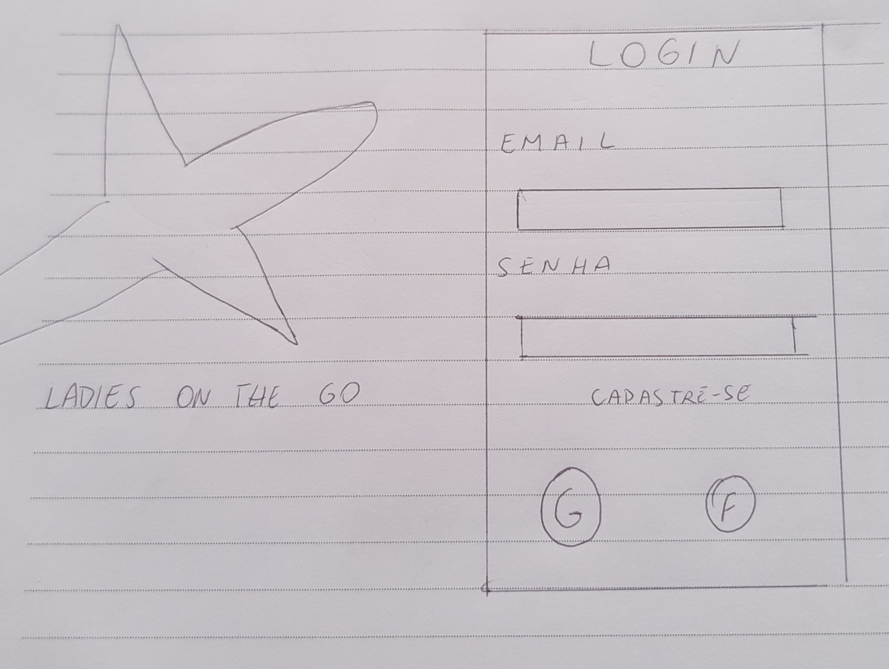
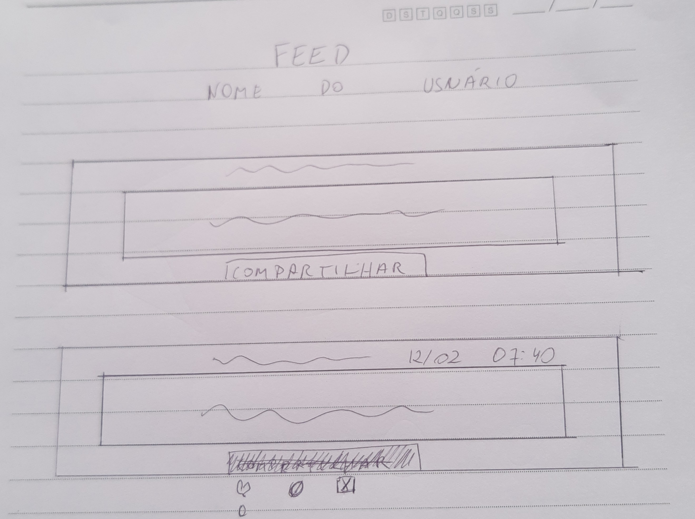
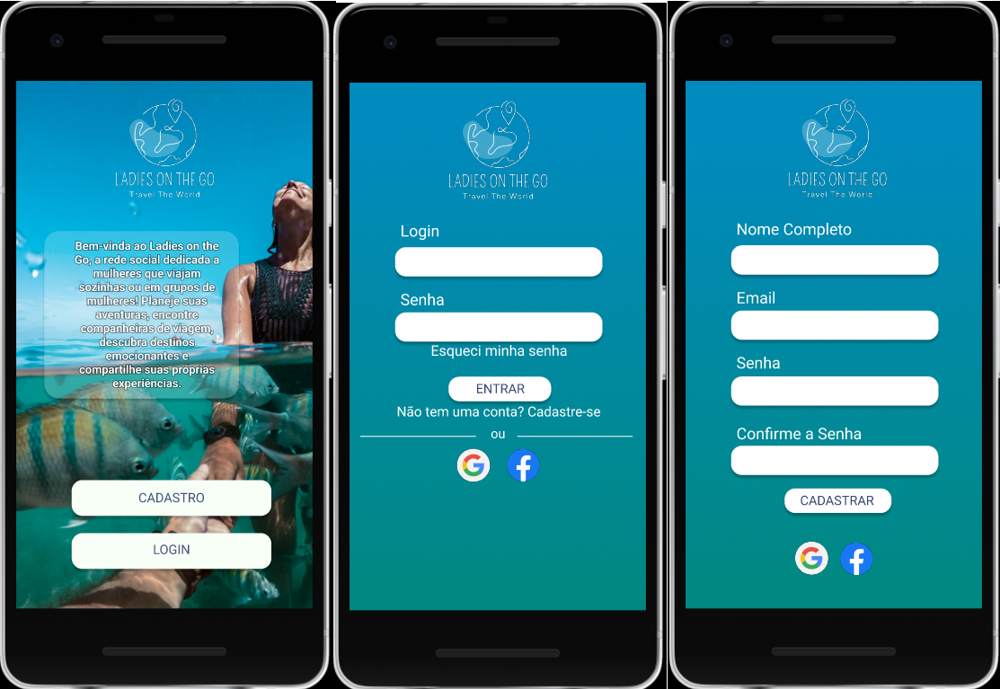
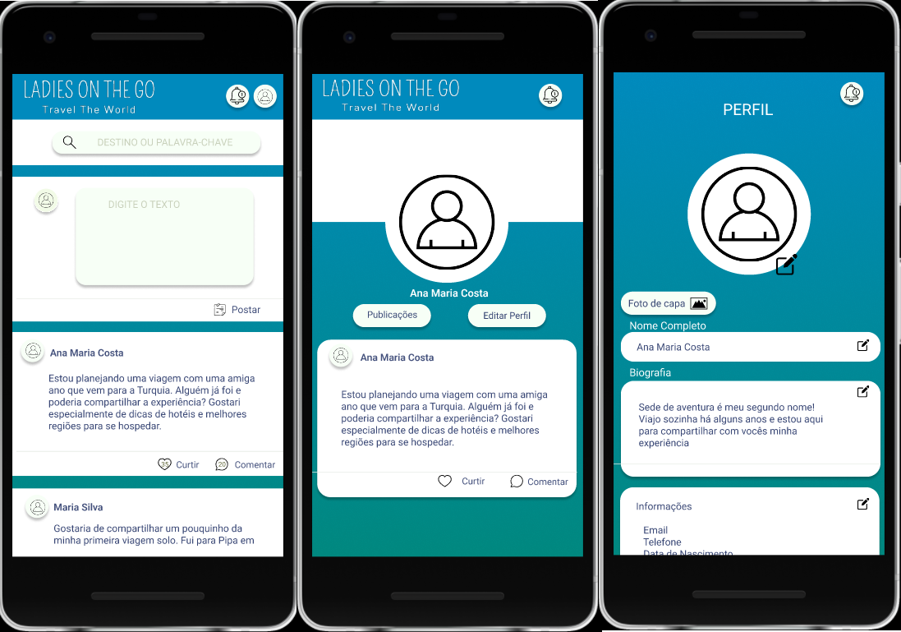
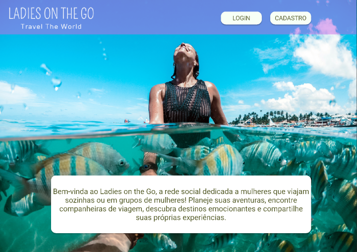
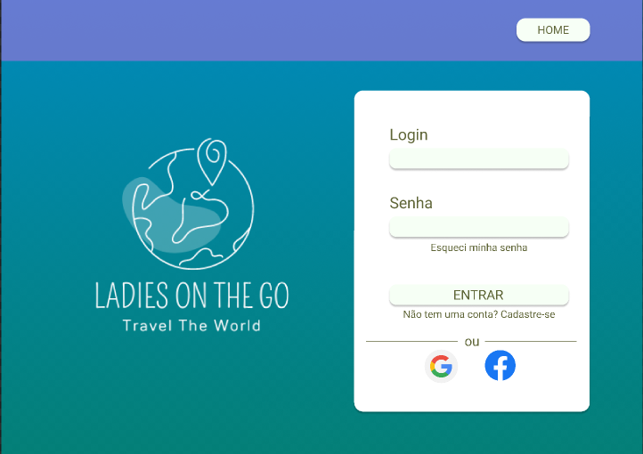
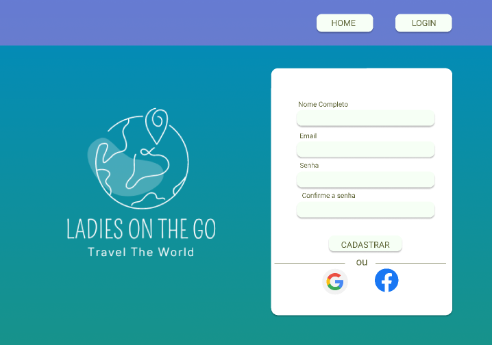
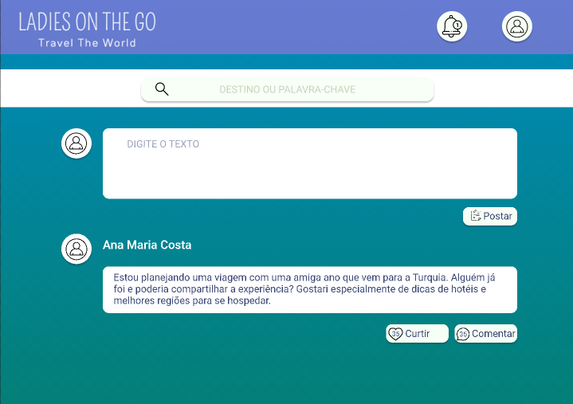
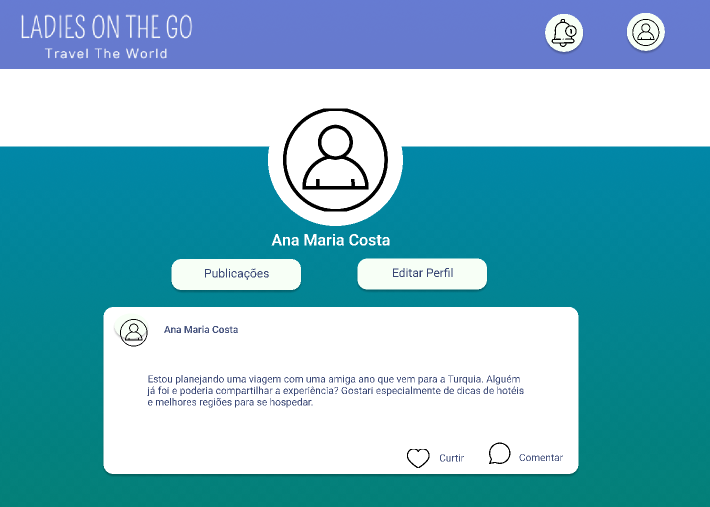
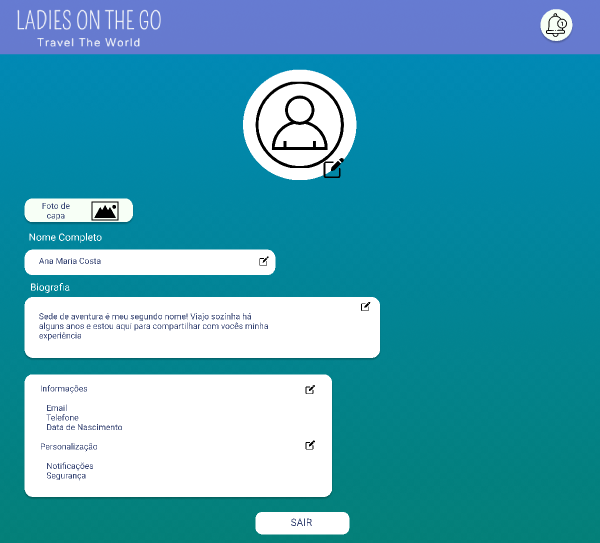

# Social Network 

## 
**Acesse o projeto:**

**Tecnologias utilizadas**

       

## Índice

* [Resumo do projeto](#resumo-do-projeto)
* [Protótipos](#protótipos)
* [Plataformas Utilizadas](#plataformas-utilizadas)
* [Definição do Produto](#definição-do-produto)
* [Histórias de usuário](#histórias-de-usuário)
* [Testes de Usabilidade](#testes-de-usabilidade)
* [Considerações gerais](#considerações-gerais)
* [Trio desenvolvedor](#trio-desenvolvedor)

***

## Resumo do projeto

Esse projeto foi baseado em uma rede social interativa, de compartilhamento de informações. O Ladies On The Go é uma plataforma web exclusivamente dedicada às mulheres que amam viajar, seja sozinhas ou em grupos formados apenas por mulheres. Nosso site visa conectar mulheres viajantes de todo o mundo, proporcionando um espaço seguro e acolhedor para compartilhar experiências, dicas de viagem, planejar roteiros e fazer novas amizades.

## Protótipos 

**Baixa fidelidade**

**Alta fidelidade**

**Mobile**

**Desktop**

## Plataformas Utilizadas

O Ladies On The Go foi desenvolvido utilizando as seguintes tecnologias:

Frontend: A interface do site foi construída utilizando HTML, CSS e JavaScript, com a ajuda do framework Vite.js para agilizar o desenvolvimento e melhorar o desempenho.

Backend: Para o backend, utilizamos a plataforma Firebase, que oferece recursos de hospedagem, autenticação de usuários e armazenamento de dados em tempo real, proporcionando uma experiência eficiente e segura para nossas usuárias.

## Definição do Produto

# Principais Usuários

Os principais usuários do produto são mulheres que desejam se conectar com outras, compartilhar suas ideias, interesses e experiências com uma comunidade online. O aplicativo é voltado para usuárias de várias idades e interesses, buscando fornecer uma experiência amigável e segura para todos.

# Problema Resolvido

O produto visa resolver o problema da falta de uma plataforma centralizada para compartilhar e interagir com outras mulheres com os mesmos interesses. Muitas vezes, as redes sociais existentes podem se tornar muito amplas ou focadas em apenas um tipo de conteúdo. O Ladies On The Go busca proporcionar um ambiente inclusivo e diversificado para as usuárias compartilharem diferentes tipos de conteúdo e se conectarem com pessoas de interesses similares.

## Histórias de usuário

1. Como um visitante do site, eu quero ver uma página inicial com uma foto e texto atraentes, para que eu possa ter uma primeira impressão positiva do site e entender seu propósito.

*Critérios de Aceitação:*

* A página inicial exibe uma foto e um texto convincente.
* Os elementos de design são atraentes e profissionais.
* Os botões de login e cadastro são visíveis e funcionais.

*Definição de Pronto:*

* A página inicial foi projetada com uma imagem atraente e texto de boas-vindas.
* O design é responsivo e se adapta a diferentes tamanhos de tela.
* A funcionalidade de login e cadastro foi implementada e testada.
* Como um usuário novo, eu quero poder me cadastrar no site para criar uma conta.

*Critérios de Aceitação:*

* A página de cadastro exibe campos para o nome completo, e-mail, senha e confirmação de senha.
* O botão "Cadastrar" registra o usuário no sistema.
* Os ícones de cadastro com o Google ou Facebook estão presentes e funcionais.

*Definição de Pronto:*

* A página de cadastro foi projetada com os campos necessários para o registro.
* A funcionalidade de cadastro foi implementada e testada.
* Os botões de cadastro com o Google ou Facebook estão funcionando corretamente.
* Como um usuário registrado, eu quero poder fazer login no site para acessar minha conta.

*Critérios de Aceitação:*

* A página de login exibe campos para o login e senha.
* O botão "Entrar" autentica o usuário no sistema.
* Existe um link para redefinir a senha, caso o usuário tenha esquecido.
* Há um link para a página de cadastro.
* Os ícones de login com o Google ou Facebook estão presentes e funcionais.

*Definição de Pronto:*

* A página de login foi projetada com os campos necessários para a autenticação.
* A funcionalidade de login foi implementada e testada.
* O link para redefinir a senha e para a página de cadastro estão funcionando corretamente.
* Os botões de login com o Google ou Facebook estão funcionando corretamente.
* Como um usuário autenticado, eu quero ver uma página inicial com recursos e funcionalidades relevantes.

*Critérios de Aceitação:*

* A página inicial exibe ícones de notificação e perfil.
* Existe uma caixa de pesquisa para buscar por destino ou palavra-chave.
* Há uma caixa de texto para postagem de conteúdo.
* As postagens de outros usuários são exibidas com opções de curtir e comentar.

*Definição de Pronto:*

* A página inicial foi projetada para exibir os ícones de notificação e perfil do usuário.
* A funcionalidade de pesquisa foi implementada e testada.
* A caixa de texto para postagem de conteúdo está funcional.
* As postagens de outros usuários estão sendo exibidas corretamente com as opções de curtir e comentar.
* Como um usuário autenticado, eu quero poder visualizar e interagir com o meu perfil.

*Critérios de Aceitação:*

* A página do perfil exibe um ícone de notificação.
* A imagem de perfil e o nome do usuário são exibidos.
* Existem botões para acessar as publicações e editar o perfil.
* As últimas publicações do usuário são exibidas.

*Definição de Pronto:*

* A página do perfil foi projetada para exibir o ícone de notificação, imagem de perfil e nome do usuário.
* A funcionalidade para acessar as publicações e editar o perfil foram implementadas e testadas.
* As últimas publicações do usuário estão sendo exibidas corretamente.
* Como um usuário autenticado, eu quero poder editar meu perfil para personalizar as informações exibidas.

*Critérios de Aceitação:*

* A página de edição do perfil exibe um ícone de notificação.
* Existe um campo para editar a foto de perfil.
* Há um botão para editar a foto de capa.
* Existem campos para editar o nome completo, informações e personalização.
* O botão "Sair" permite que o usuário faça logout do site.

*Definição de Pronto:*

* A página de edição do perfil foi projetada para exibir o ícone de notificação e campos para edição.
* A funcionalidade para editar a foto de perfil e de capa foram implementadas e testadas.
* Os campos para edição do nome completo, informações e personalização foram implementados e testados.
* O botão "Sair" está funcionando corretamente para fazer logout do site.

## Testes de Usabilidade

Comentários sobre o conteúdo, diagramação e funcionalidades:

Usuario 1: Acessado por celular, observou que o footer cobria as postagens no feed, porém achou o design intuitivo e organizado. Sugeriu que na página de entrada as cores fossem alteradas para combinar com a imagem de fundo. Teve acesso facilmente a informação sem problemas no uso.

Usuario 2 : Acessado por celular e navegador. Observou a necessidade de um botão para voltar ao inicio em todas as páginas e que ficasse bem visível. Apreciou a uniformidade das cores e formatos. 

## Considerações gerais

* O Ladies On The Go foi criado com muito amor e dedicação, com o propósito de ser um espaço acolhedor e inspirador para mulheres viajantes. Nossa equipe valoriza a inclusão, a diversidade e o respeito mútuo, tornando o site um ambiente positivo e enriquecedor.

Agradecemos a todas as mulheres viajantes que contribuíram para a criação deste projeto, compartilhando suas histórias e ideias. Também agradecemos à equipe de desenvolvimento por seu esforço e habilidade na criação desta plataforma.

Esperamos que o Ladies On The Go seja uma ferramenta valiosa para todas as mulheres viajantes, ajudando-as a explorar o mundo com confiança e conexão. Juntas, podemos criar uma comunidade forte e unida de mulheres que amam viajar e desbravar novas aventuras!

## Trio desenvolvedor

Projeto desenvolvido por [Maíra Bergamaschi](https://github.com/mairabergamaschi), [Marina Cordeiro](https://github.com/Marinacb7) e [Thais Alves](https://github.com/thaisalvespereira)

  -*-*-*-*-